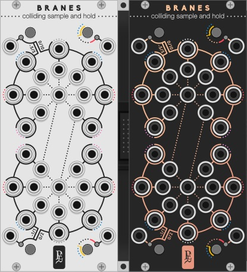

# A Modular Collection for VCV Rack by Pyer

Module concept and graphics by Pierre Collard (Pyer), code By [Marc Boulé](https://github.com/MarcBoule).

Version 0.6.0

## License

Based on code from the Fundamental plugins by Andrew Belt and graphics from the Component Library by Wes Milholen. See ./LICENSE.txt for all licenses (and ./res/fonts/ for font licenses).

# Modules 

Here are the modules.

* [Black Holes](#blackholes): Gravitational Attenumixer.

* [Pulsars](#pulsars): Neutron-Powered Crossfader.

* [Branes](#branes): Colliding Sample-and-Hold.

* [Ions](#ions): Atomic Dual Sequencer.

Details about each module are given in the [user manual](GeodesicsUserManualBeta.pdf).

## Black Holes 

TODO

## Pulsars 

TODO

## Branes 

TODO

## Ions 

TODO
